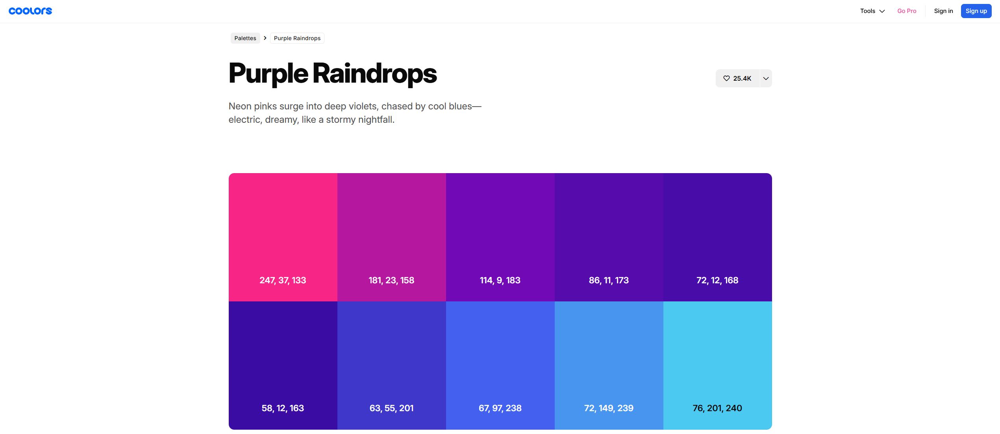

### Задача

Разработать и оформить интерактивный HTML+CSS-блок «Обо мне», адаптированный под GitHub Pages, который вы сможете встроить в свою персональную страницу. Блок должен быть адаптивным, визуально чистым и содержать ключевую информацию о вас.

### Этапы выполнения проекта

1. Создать структуру раздела «Обо мне»
    - Написать HTML-разметку с использованием семантических тегов (`<section>`, `<article>`, `<h2>`, `
`, `` и т. п.).
    - Включить в раздел информацию о себе: имя, краткое описание, интересы, ссылки на GitHub, HeadHunter и т. п.
2. Стилизовать блок с помощью CSS
    - Настроить шрифты, отступы, фон, цвета, рамки.
    - Сделать базовую адаптивность: корректное отображение на мобильных устройствах.
3. Добавить интерактивные элементы (по желанию)
    - Эффекты наведения на ссылки и кнопки.
    - Переключатель темы (светлая/темная) через CSS-переменные.
4. Опубликовать страницу через GitHub Pages
    - Разместить итоговый проект в отдельном репозитории.
    - Активировать GitHub Pages и проверить отображение раздела.

### Словарь
**Семантические теги** — это элементы HTML, которые описывают смысл содержимого страницы, а не только его внешний вид. Такие теги, как `<section>`, `<article>`, `<header>` делают код более понятным и доступным как для людей, так и для поисковых систем и вспомогательных технологий.

**GitHub Pages** — это бесплатный сервис от GitHub, позволяющий размещать статические сайты (созданные с использованием HTML, CSS и JavaScript) прямо из репозитория. Он широко используется для публикации портфолио, документации и учебных проектов.

**Адаптивность** — это способность веб-страницы подстраиваться под размер экрана устройства, на котором она открыта. Это позволяет одному сайту выглядеть и работать удобно как на компьютерах, так и на планшетах и смартфонах.

**Hover-эффект** — это визуальное изменение элемента на странице, которое происходит при наведении на него курсора мыши. Это может быть изменение цвета, появление подчеркивания, масштабирование изображения и другие реакции.

**Переход (transition)** — это CSS-свойство, которое позволяет изменениям внешнего вида элемента происходить плавно, а не мгновенно. Оно используется, например, для того, чтобы при наведении цвет кнопки менялся постепенно.

**Flex (Flexbox)** — один из модулей CSS, основная задача которого — продвинутое позиционирование элементов.

### Цветовая схема

В проекте используются следующие цвета:
- rgba(247, 37, 133, 1)
- rgba(181, 23, 158, 1)
- rgba(114, 9, 183, 1)
- rgba(86, 11, 173, 1)
- rgba(72, 12, 168, 1)
- rgba(58, 12, 163, 1)
- rgba(63, 55, 201, 1)
- rgba(67, 97, 238, 1)
- rgba(72, 149, 239, 1)
- rgba(76, 201, 240, 1)
- rgba(2, 3, 20, 1)

### Ссылки
- [Мета-теги](https://doka.guide/html/meta/)
- [Блочные и строчные элементы разметки HTML](https://developer.mozilla.org/ru/docs/Learn_web_development/Core/Styling_basics/Box_model)